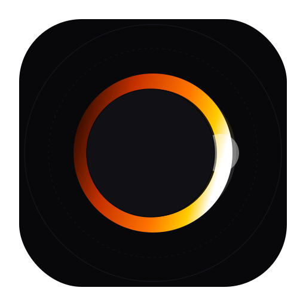
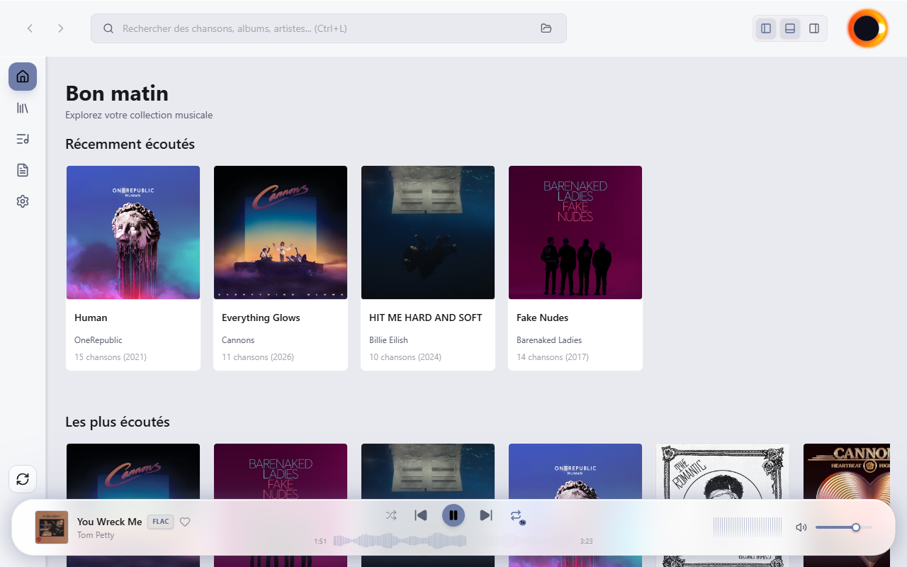
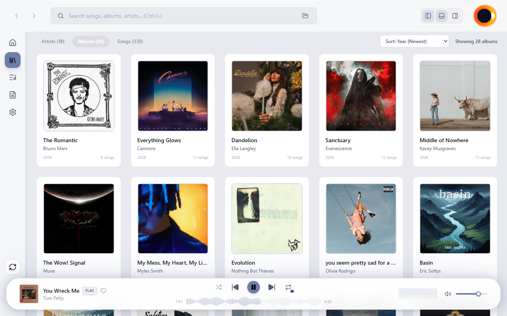
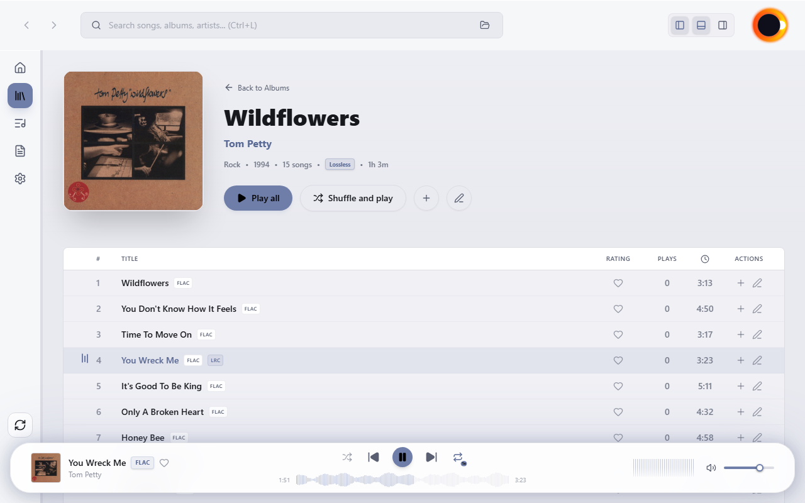
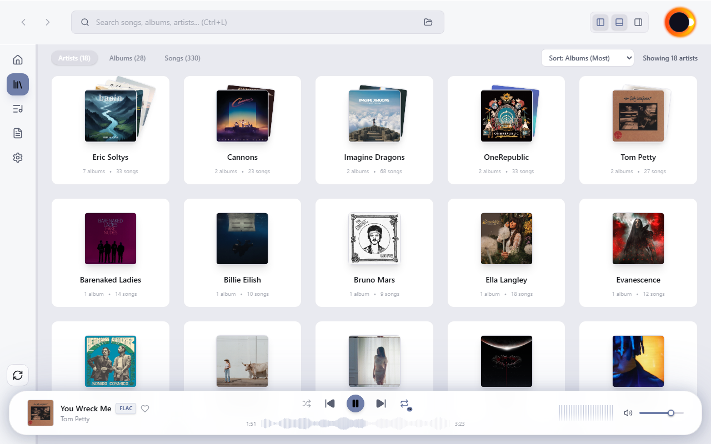
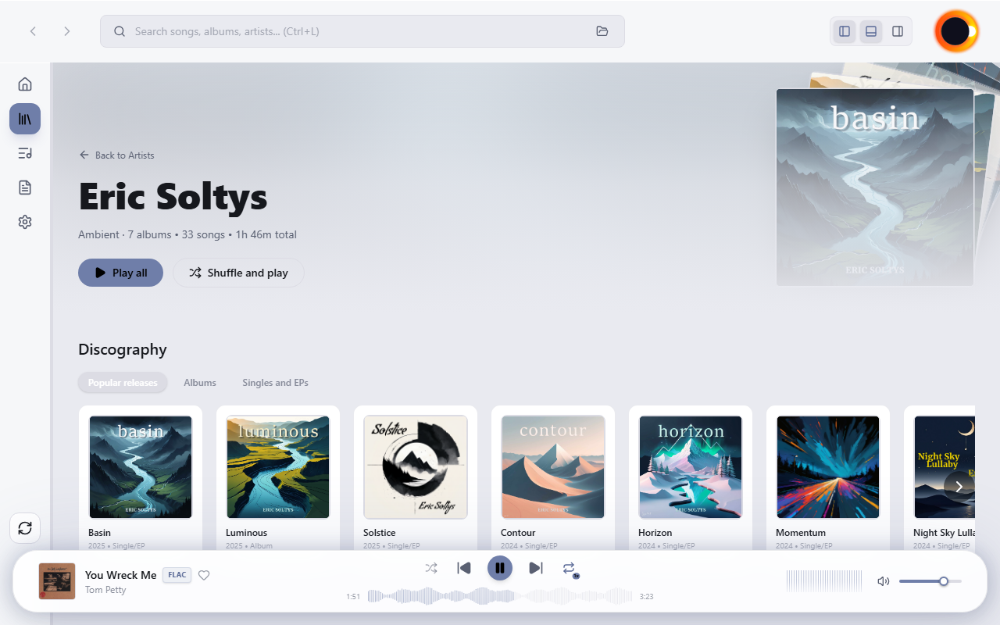
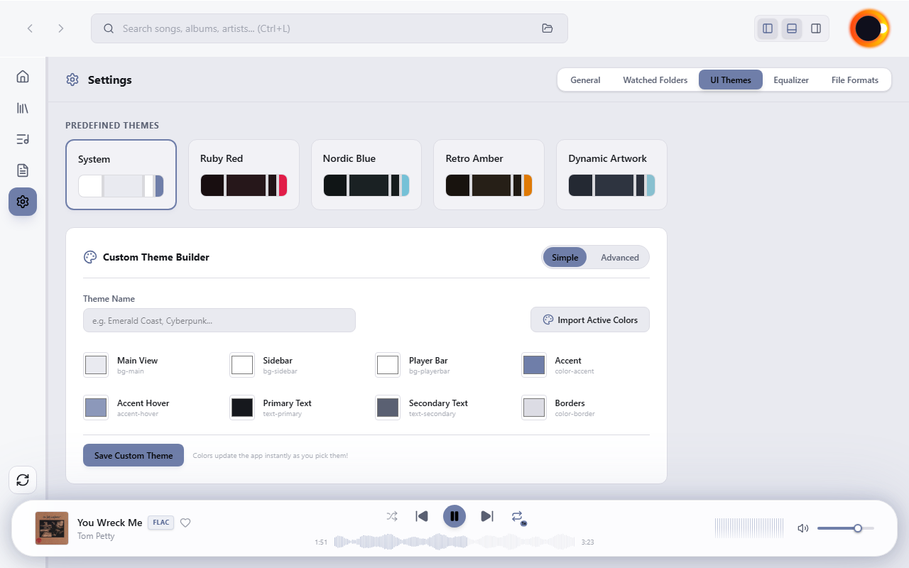
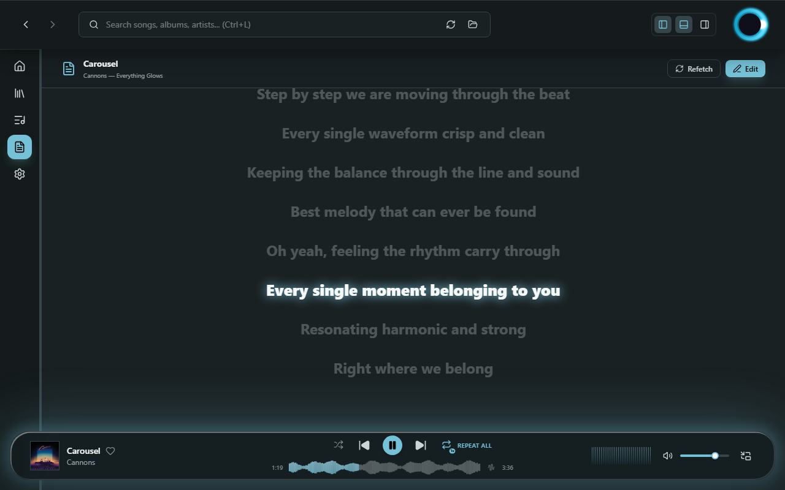
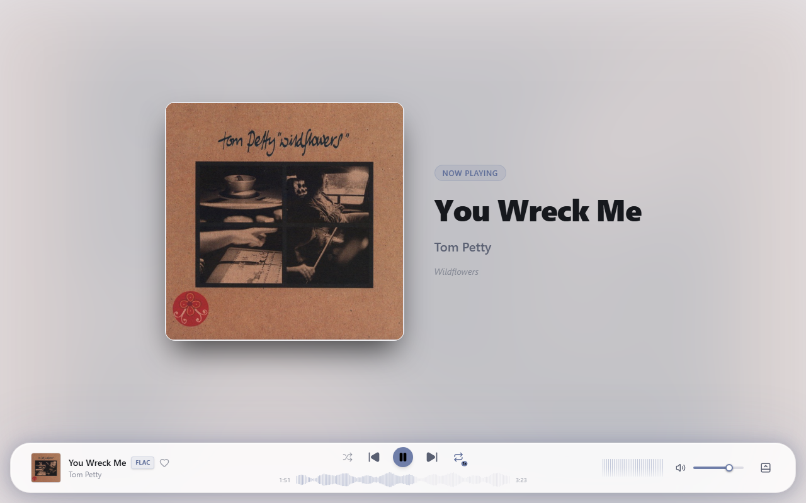

#  Luminous Music Player

[](https://www.rust-lang.org)
[](https://tauri.app)
[](https://www.typescriptlang.org)
[](https://svelte.dev)
[](https://github.com/esoltys/luminous/releases/latest)
[](https://github.com/esoltys/luminous/milestone/1)

Luminous is a high-performance desktop music player designed for modern local audio listening. Built with **Rust**, **Tauri v2**, **TypeScript**, and **Svelte 5 (Runes)**, it offers a lightweight, premium desktop experience with a beautiful dynamic user interface. Made in Canada 🍁 and available in both English and French.

### Downloads

You can download the latest installers and portable binaries directly from the GitHub Releases page:

* **🐧 Linux** — **[Download .deb / .AppImage](https://github.com/esoltys/luminous/releases/latest)** (Debian, Ubuntu, and AppImage packages for x64)
* **🪟 Windows** — **[Download .exe / .msi](https://github.com/esoltys/luminous/releases/latest)** (Installers and portable binaries for Windows x64)


<div align="center">
  <table>
    <tr>
        <td colspan="2">
            <h4 align="center">Home View</h4>
            
        </td>
    </tr>
    <tr>
      <td width="50%">
        <h4 align="center">Albums Overview</h4>
        
      </td>
      <td width="50%">
        <h4 align="center">Album Detail</h4>
        
      </td>
    </tr>
    <tr>
      <td width="50%">
        <h4 align="center">Artists Overview</h4>
        
      </td>
      <td width="50%">
        <h4 align="center">Artist Detail</h4>
        
      </td>
    </tr>
    <tr>
      <td width="50%">
        <h4 align="center">Custom Theme Builder</h4>
        
      </td>
      <td width="50%>
        <h4 align="center">Synced Lyrics</h4>
        
      </td>
    </tr>
    <tr>
        <td colspan="2">
            <h4 align="center">Immersive Now Playing</h4>
            
        </td>
    </tr>
  </table>
</div>


---

## Product Highlights

*   **Personalized Home Hub**: Start your listening with a tailored dashboard featuring time-of-day greetings and smart curation rows: Recently Played, Most Played, and Recently Added. Browse your library with interactive cover art carousels and discover tracks at a glance.
*   **Instant Search and Navigation**: Locate any track, album, or artist in your collection instantly using database-level SQLite FTS5 (Full-Text Search) with split-second response times.
*   **High-Performance Library Scanner**: Index thousands of local audio files (MP3, WAV, FLAC, AAC, Ogg Vorbis) in seconds using an incremental scanner that intelligently skips unchanged files based on modification times.
*   **Immersive Audio Visualizers**: View your music with a real-time 32-bar logarithmic spectrum analyzer rendering at 30 FPS, colorized spectral moodbars, and SoundCloud-style peak waveform seek bars.
*   **Gapless Playback**: Tracks flow into one another with no silence or clicks. The engine decodes the next track ahead of the boundary and hands over seamlessly — ideal for live albums, concept records, and DJ mixes.
*   **Dual-Mode Equalizer**: Shape your sound with a 10-band graphic equalizer (cascaded biquad DSP and genre presets) or switch to a 20-band parametric mode with adjustable Q per band and a live response-curve preview. Both modes leave the signal untouched when disabled.
*   **Karaoke Synced Lyrics**: Enjoy real-time, scrolling synced lyrics (LRC) fetched automatically from LRCLIB or plain text from Lyrics.ovh, complete with local caching and visual synced-lyrics indicators.
*   **AcoustID Fingerprinting and Tag Editor**: Automatically identify tracks and correct metadata using AcoustID acoustic fingerprinting (via `fpcalc`), and write tags directly back to your local files.
*   **Smart Cover Art Engine**: Extract embedded artwork automatically using lofty tag parsing, with automatic iTunes Search API fallback and local file deduplication.
*   **Dynamic Theme Engine**: Switch between curated color themes (such as Luminous Violet, Ruby Red, Nordic Blue, and Retro Amber) or design your own with an interactive, real-time Custom Theme Builder that updates the application interface live.
*   **Bilingual Interface**: Made in Canada 🍁 — the entire UI is fully translated between English and French, switchable instantly from the General settings tab.
*   **Seamless State Preservation**: Never lose your place. Luminous automatically restores your active sidebar width, playlist selections, player volume, queue state, and equalizer configuration when the application is reopened.

---

## Architecture

```
luminous/
├── features/                 # BDD Gherkin Feature Specifications
├── src/                      # Svelte 5 + TypeScript Frontend
│   ├── lib/
│   │   ├── components/       # PlayerBar, Visualizers, Equalizer, LyricsView, TagEditor, etc.
│   │   ├── stores/           # Global stores (player, collection, playlists, theme)
│   │   ├── types/            # Frontend interfaces
│   │   └── utils/            # Shared utilities (color parsing, accessibility, etc.)
│   └── routes/               # Layouts and navigation views
└── src-tauri/                # Tauri + Rust Backend Core
    ├── src/
    │   ├── analyzer.rs       # Real-time FFT spectrum processing
    │   ├── audio.rs          # Symphonia decoding thread & CPAL playback loop with gapless double-buffering
    │   ├── collection.rs     # Lofty scanner & folder watcher
    │   ├── covermanager.rs   # Cover art extractor and iTunes search API fallback
    │   ├── db.rs             # SQLite schema migration & connection pool
    │   ├── equalizer.rs      # Biquad DSP: 10-band graphic & 20-band parametric filters
    │   ├── lib.rs            # Library entry point, background loops, & IPC registry
    │   ├── lyrics.rs         # LRCLIB & Lyrics.ovh client integrations
    │   ├── main.rs           # Binary entry point invoking luminous_lib::run()
    │   ├── models.rs         # Shared structs and types
    │   ├── moodbar.rs        # Spectral audio analysis scanner
    │   ├── player.rs         # Playback controller (Shuffle, Repeat, Next/Prev)
    │   ├── playlist.rs       # Playlist manager & undo/redo command stack
    │   ├── tageditor.rs      # lofty tag writer & AcoustID fingerprint generator
    │   ├── waveform.rs       # Background audio peak analyzer
    │   └── commands/         # Tauri IPC command handlers
    └── Cargo.toml            # Rust dependencies (cpal, symphonia, rusqlite, lofty, rustfft)
```

---

## Building Luminous

Luminous is a cross-platform application that can be built and run on both Linux and Windows.

### Linux (Ubuntu/Debian)

#### 1. Install System Dependencies
Ensure the required build tools, GTK, WebKit, ALSA, and SSL development headers are installed:
```bash
sudo apt update
sudo apt install -y build-essential curl wget file libssl-dev libgtk-3-dev libwebkit2gtk-4.1-dev libsoup-3.0-dev libayatanaloop-dev libayatana-appindicator3-dev librsvg2-dev libasound2-dev pkg-config
```

#### 2. Install Bun & Rust
*   **Bun**: Install the JavaScript runtime & package manager:
    ```bash
    curl -fsSL https://bun.sh/install | bash
    ```
*   **Rust**: Install the Rust toolchain:
    ```bash
    curl --proto '=https' --tlsv1.2 -sSf https://sh.rustup.rs | sh
    ```

#### 3. Run Development Server

```bash
bun install
bun run install:git-hooks # sets core.hooksPath to use the repository's tracked .githooks/pre-commit hook
bun run tauri dev
```
#### 4. Build Production Bundle
```bash
bun run tauri build
```

---

### Windows

#### 1. Install Microsoft C++ Build Tools
Download and install the [Visual Studio Installer](https://visualstudio.microsoft.com/visual-cpp-build-tools/). Select the **Desktop development with C++** workload and ensure the MSVC C++ build tools are checked.

#### 2. Install Bun & Rust
Install the JavaScript runtime, package manager, and Rust toolchain

```powershell
winget install Oven-sh.Bun Rustlang.Rustup
```

#### 3. Run Development Server
Run the following commands in your terminal (e.g., PowerShell or Command Prompt):
```powershell
bun install
bun run tauri dev
```

#### 4. Build Production Bundle
```powershell
bun run tauri build
```

---

### AcoustID / Chromaprint Setup (Optional)

To enable AcoustID audio fingerprinting and automatic metadata lookup, you need both the `fpcalc` utility and a valid AcoustID API key:

#### 1. Install `fpcalc`
*   **Linux (Ubuntu/Debian)**:
    ```bash
    sudo apt install libchromaprint-tools
    ```
*   **Windows**:
    Download the binary from the [AcoustID Website](https://acoustid.org/chromaprint), extract it, and add the folder containing `fpcalc.exe` to your system `PATH`. Alternatively, you can set the `FPCALC_PATH` environment variable pointing directly to the binary.

#### 2. Get and Set an AcoustID API Key
1. Register or log in to the [AcoustID Website](https://acoustid.org/).
2. Go to the [My Applications](https://acoustid.org/my-applications) page and register Luminous as a new application to generate a free **Client API Key**.
3. Set the key as the `ACOUSTID_API_KEY` environment variable before starting the application.

---

## Testing and Specifications

Luminous uses automated tests at both the frontend (Svelte 5) and backend (Rust) layers.

### Frontend Unit & Integration Tests (Vitest)

Frontend tests are written with Vitest and test component rendering, Svelte 5 stores, and state updates with mocked Tauri APIs.

To run the frontend test suite:
```bash
bun run test:run
```

### Backend Unit & Integration Tests (Rust)

To run the standard cargo unit test suite:
```bash
cd src-tauri
cargo test
```
