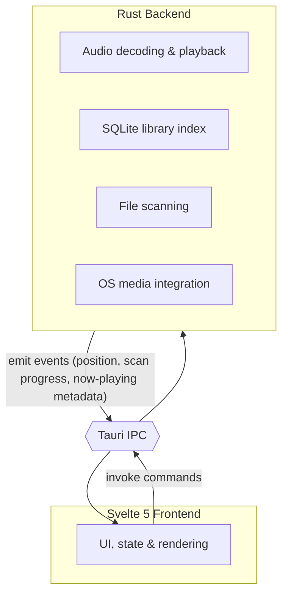

[](https://www.rust-lang.org)
[](https://tauri.app)
[](https://www.typescriptlang.org)
[](https://svelte.dev)
[](https://github.com/esoltys/luminous/releases/latest)
[](https://github.com/esoltys/luminous/milestone/1)
[](https://github.com/esoltys/luminous/milestones)

# A high-performance home for the music you already own.

Luminous is a fast, local-first player for your own audio library — no streaming, no subscriptions, no cloud. Just your files, indexed, searchable, and beautifully played. Built with **Rust**, **Tauri v2**, **TypeScript**, and **Svelte 5 (Runes)**.

 🏠 **[Luminous Homepage](https://esoltys.dev/luminous.dc.html)** — downloads, screenshots, and feature overview
 
💬 **[Luminous Discussions](https://github.com/esoltys/luminous/discussions)** - announcements, general discussion, Q&A, Show and Tell

⭐ **[Issues](https://github.com/esoltys/luminous/issues)** - file a bug report or a feature request

---

## Architecture

Luminous splits cleanly along the Tauri boundary: a Svelte 5 frontend handles UI, state, and rendering, while a Rust backend owns everything performance- or system-sensitive — audio decoding and playback, the SQLite-backed library index, file scanning, and OS media integration. The two sides talk over Tauri's IPC layer, with the frontend invoking commands and the backend emitting events for things like playback position, scan progress, and now-playing metadata. Keeping decoding, DSP, and disk I/O in Rust off the UI thread is what lets a multi-thousand-track library scan, gapless-playback, and real-time visualizers stay smooth at once.


```mermaid
flowchart TD
    subgraph Frontend["Svelte 5 Frontend"]
        UI["UI, state & rendering"]
    end

    IPC{{"Tauri IPC"}}

    subgraph Backend["Rust Backend"]
        Audio["Audio decoding & playback"]
        DB["SQLite library index"]
        Scan["File scanning"]
        Media["OS media integration"]
    end

    Frontend ~~~ Backend

    UI -- "invoke commands" --> IPC --> Backend
    Backend -- "emit events (position, scan progress, now-playing metadata)" --> IPC --> UI
```

```
luminous/
├── features/                 # BDD Gherkin Feature Specifications
├── src/                      # Svelte 5 + TypeScript Frontend
│   ├── lib/
│   │   ├── components/       # PlayerBar, Visualizers, Equalizer, LyricsView, TagEditor, etc.
│   │   ├── locales/          # English & French translation strings
│   │   ├── stores/           # Global stores (player, collection, playlists, theme, i18n, prefs)
│   │   ├── types/            # Frontend interfaces
│   │   └── utils/            # Shared utilities (color parsing, filter parsing, lyrics, stats, etc.)
│   └── routes/               # Layouts and navigation views
└── src-tauri/                # Tauri + Rust Backend Core
    ├── src/
    │   ├── analyzer.rs       # Real-time FFT spectrum processing
    │   ├── audio.rs          # Symphonia decoding thread & CPAL playback loop with gapless double-buffering
    │   ├── collection.rs     # Lofty scanner & folder watcher
    │   ├── covermanager.rs   # Cover art extractor and iTunes search API fallback
    │   ├── db.rs             # SQLite schema migration & connection pool
    │   ├── equalizer.rs      # Biquad DSP: 10-band graphic & 20-band parametric filters
    │   ├── filter_parser.rs  # Search filter syntax parser (artist:, album:, year:, etc.)
    │   ├── install_format.rs # Distro/package format detection for the updater
    │   ├── lib.rs            # Library entry point, background loops, & IPC registry
    │   ├── loudness.rs       # EBU R128 loudness analysis & ReplayGain fallback
    │   ├── lyrics.rs         # LRCLIB & Lyrics.ovh client integrations
    │   ├── main.rs           # Binary entry point invoking luminous_lib::run()
    │   ├── media_session.rs  # OS media transport integration (SMTC, MPRIS2, Now Playing)
    │   ├── models.rs         # Shared structs and types
    │   ├── moodbar.rs        # Spectral audio analysis scanner
    │   ├── organizer.rs      # Tag-based file/folder reorganizer
    │   ├── player.rs         # Playback controller (Shuffle, Repeat, Next/Prev)
    │   ├── playlist.rs       # Playlist manager & undo/redo command stack
    │   ├── playlist_parsers.rs # M3U, M3U8, PLS, and XSPF import/export
    │   ├── stats.rs          # Play counts, ratings, and history tracking
    │   ├── tageditor.rs      # lofty tag writer & AcoustID fingerprint generator
    │   ├── waveform.rs       # Background audio peak analyzer
    │   └── commands/         # Tauri IPC command handlers
    └── Cargo.toml            # Rust dependencies (cpal, symphonia, rusqlite, lofty, rustfft)
```

---

## Building Luminous

Luminous is a cross-platform application that can be built and run on both Linux and Windows.

### Linux (Ubuntu/Debian)

#### 1. Install System Dependencies
Ensure the required build tools, GTK, WebKit, ALSA, and SSL development headers are installed:
```bash
sudo apt update
sudo apt install -y build-essential curl wget file libssl-dev libgtk-3-dev libwebkit2gtk-4.1-dev libsoup-3.0-dev libayatanaloop-dev libayatana-appindicator3-dev librsvg2-dev libasound2-dev pkg-config
```

#### 2. Install Bun & Rust
*   **Bun**: Install the JavaScript runtime & package manager:
    ```bash
    curl -fsSL https://bun.sh/install | bash
    ```
*   **Rust**: Install the Rust toolchain:
    ```bash
    curl --proto '=https' --tlsv1.2 -sSf https://sh.rustup.rs | sh
    ```

#### 3. Run Development Server

```bash
bun install
bun run install:git-hooks # sets core.hooksPath to use the repository's tracked .githooks/pre-commit hook
bun run tauri dev
```
#### 4. Build Production Bundle
```bash
bun run tauri build
```

---

### Windows

#### 1. Install Microsoft C++ Build Tools
Download and install the [Visual Studio Installer](https://visualstudio.microsoft.com/visual-cpp-build-tools/). Select the **Desktop development with C++** workload and ensure the MSVC C++ build tools are checked.

#### 2. Install Bun & Rust
Install the JavaScript runtime, package manager, and Rust toolchain

```powershell
winget install Oven-sh.Bun Rustlang.Rustup
```

#### 3. Run Development Server
Run the following commands in your terminal (e.g., PowerShell or Command Prompt):
```powershell
bun install
bun run tauri dev
```

#### 4. Build Production Bundle
```powershell
bun run tauri build
```

---

### AcoustID / Chromaprint Setup (Optional)

To enable AcoustID audio fingerprinting and automatic metadata lookup, you need both the `fpcalc` utility and a valid AcoustID API key:

#### 1. Install `fpcalc`
*   **Linux (Ubuntu/Debian)**:
    ```bash
    sudo apt install libchromaprint-tools
    ```
*   **Windows**:
    Download the binary from the [AcoustID Website](https://acoustid.org/chromaprint), extract it, and add the folder containing `fpcalc.exe` to your system `PATH`. Alternatively, you can set the `FPCALC_PATH` environment variable pointing directly to the binary.

#### 2. Get and Set an AcoustID API Key
1. Register or log in to the [AcoustID Website](https://acoustid.org/).
2. Go to the [My Applications](https://acoustid.org/my-applications) page and register Luminous as a new application to generate a free **Client API Key**.
3. Set the key as the `ACOUSTID_API_KEY` environment variable before starting the application.

---

## Testing and Specifications

Luminous uses automated tests at both the frontend (Svelte 5) and backend (Rust) layers.

### Frontend Unit & Integration Tests (Vitest)

Frontend tests are written with Vitest and test component rendering, Svelte 5 stores, and state updates with mocked Tauri APIs.

To run the frontend test suite:
```bash
bun run test:run
```

### Backend Unit & Integration Tests (Rust)

To run the standard cargo unit test suite:
```bash
cd src-tauri
cargo test
```
This also runs the Gherkin feature specs under [`features/`](features) — each `.feature` file has a matching test in `src-tauri/tests/`, so no separate command is needed to exercise them.
