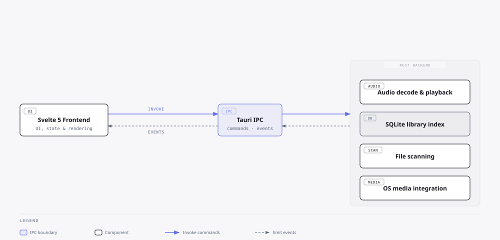

[](https://www.rust-lang.org)
[](https://tauri.app)
[](https://www.typescriptlang.org)
[](https://svelte.dev)

# A high-performance home for the music you already own.

Luminous is a fast, local-first player for your own audio library — no streaming, no subscriptions, no cloud. Just your files, indexed, searchable, and beautifully played. Built with **Rust**, **Tauri v2**, **TypeScript**, and **Svelte 5 (Runes)**.

 🏠 **[Luminous Homepage](https://esoltys.dev/luminous/)** — downloads, screenshots, and feature overview
 
💬 **[Luminous Discussions](https://github.com/esoltys/luminous/discussions)** - announcements, general discussion, Q&A, Show and Tell

⭐ **[Issues](https://github.com/esoltys/luminous/issues)** - file a bug report or a feature request

---

## Quick Install

[](https://apps.microsoft.com/detail/9PNQ2NFSQ7XW?launch=true&mode=full)

- **Windows**: get it from the **[Microsoft Store](https://apps.microsoft.com/detail/9PNQ2NFSQ7XW)** (recommended — installs and updates automatically), or grab `Luminous_{version}_x64-setup.exe` (or the `.msix`) from the **[Releases page](https://github.com/esoltys/luminous/releases/latest)** for a manual/sideloaded install.
- **Linux**: download the `.deb` or `.rpm` for your distro from the **[Releases page](https://github.com/esoltys/luminous/releases/latest)** and install it as usual.

> **Flathub submission in progress.** A Flatpak manifest is tracked in-repo at [`flatpak/org.luminous.music.yml`](./flatpak/org.luminous.music.yml) and built/linted in CI (see [#419](https://github.com/esoltys/luminous/issues/419)), but Luminous isn't published on Flathub yet — once it is, `flatpak install flathub org.luminous.music` will be added here as a third Linux install option alongside `.deb`/`.rpm`.

> **No AppImage right now.** Tauri's AppImage bundling links against WebKitGTK/Mesa/EGL libraries baked in at build time, and on many host systems that collides with the system's own graphics stack, producing a window that opens fully blank (`Could not create default EGL display: EGL_BAD_PARAMETER`) — this is an [upstream](https://github.com/tauri-apps/tauri/issues/11988) [Tauri/WebKitGTK](https://girishjoshi.io/post/tauri-2.0-appimage-egl-issue-on-wayland/) bug, not something app code can work around, and the only real fix (an experimental, unreleased Tauri bundler branch) isn't stable enough to ship. Use the `.deb`/`.rpm` above, or build your own AppImage locally with `bun run tauri build -b appimage` (see [Building Luminous](#building-luminous)) — a locally built one links against your own system libraries and doesn't hit this.

---

## Architecture

> **"Isn't this just a web wrapper?"** Not in the Electron sense. Tauri renders the UI in the OS's own webview (WebView2 on Windows, WebKit on Linux/macOS) instead of bundling a full Chromium, so there's no shipped browser engine inflating the binary or idling in RAM. And the UI is the only part that's web tech — audio decoding/output, DSP, the library scanner, and the SQLite index all run as native Rust off the UI thread, driving the frontend through events rather than the other way around. See below for how the two sides split.

Luminous splits cleanly along the Tauri boundary: a Svelte 5 frontend handles UI, state, and rendering, while a Rust backend owns everything performance- or system-sensitive — audio decoding and playback, the SQLite-backed library index, file scanning, and OS media integration. The two sides talk over Tauri's IPC layer, with the frontend invoking commands and the backend emitting events for things like playback position, scan progress, and now-playing metadata. Keeping decoding, DSP, and disk I/O in Rust off the UI thread is what lets a multi-thousand-track library scan, gapless-playback, and real-time visualizers stay smooth at once.

The IPC commands are deliberately *deep*: each one owns a whole workflow rather than forwarding a single field. The backend owns the built-in Queue (bootstrapped at startup, exposed via an `is_queue` flag — the frontend never infers it from a name), applies equalizer changes as one whole-config call, and keeps every dynamic playlist — genre/decade/BPM auto playlists and user smart playlists alike — *always complete*: whenever the library or a song's stats change, a backend reconciler immediately appends newly-matching songs and evicts stale ones, syncing the live play order without ever reshuffling it. There is no refill logic, and no such setting, anywhere in the frontend.



```
luminous/
├── features/                 # BDD Gherkin Feature Specifications
├── src/                      # Svelte 5 + TypeScript Frontend
│   ├── lib/
│   │   ├── components/       # PlayerBar, Visualizers, Equalizer, LyricsView, TagEditor, etc.
│   │   ├── locales/          # English & French translation strings
│   │   ├── stores/           # Global stores (player, collection, playlists, theme, i18n, prefs)
│   │   ├── types/            # Frontend interfaces
│   │   └── utils/            # Shared utilities (color parsing, filter parsing, lyrics, stats, etc.)
│   └── routes/               # Layouts and navigation views
└── src-tauri/                # Tauri + Rust Backend Core
    ├── src/
    │   ├── analyzer.rs       # Real-time FFT spectrum processing
    │   ├── audio.rs          # Symphonia decoding thread & CPAL playback loop with gapless double-buffering
    │   ├── band_waveform.rs  # Layered low/mid/high frequency-band waveform analysis scanner
    │   ├── collection.rs     # Lofty scanner & folder watcher
    │   ├── covermanager.rs   # Cover art extractor and iTunes search API fallback
    │   ├── db.rs             # SQLite schema migration & connection pool
    │   ├── equalizer.rs      # Biquad DSP: 10-band graphic & 20-band parametric filters
    │   ├── filter_parser.rs  # Search filter syntax parser (artist:, album:, year:, etc.)
    │   ├── install_format.rs # Distro/package format detection for the updater
    │   ├── lib.rs            # Library entry point, background loops, & IPC registry
    │   ├── loudness.rs       # EBU R128 loudness analysis & ReplayGain fallback
    │   ├── lyrics.rs         # LRCLIB & Lyrics.ovh client integrations
    │   ├── main.rs           # Binary entry point invoking luminous_lib::run()
    │   ├── media_session.rs  # OS media transport integration (SMTC, MPRIS2, Now Playing)
    │   ├── models.rs         # Shared structs and types
    │   ├── organizer.rs      # Tag-based file/folder reorganizer
    │   ├── player.rs         # Playback controller (Shuffle, Repeat, Next/Prev)
    │   ├── playlist.rs       # Playlist manager, Queue abstraction, dynamic-playlist reconciler & undo/redo stack
    │   ├── playlist_parsers.rs # M3U, M3U8, PLS, and XSPF import/export
    │   ├── stats.rs          # Play counts, ratings, and history tracking
    │   ├── tageditor.rs      # lofty tag writer & AcoustID fingerprint generator
    │   ├── waveform.rs       # Background audio peak analyzer
    │   └── commands/         # Tauri IPC command handlers
    └── Cargo.toml            # Rust dependencies (cpal, symphonia, rusqlite, lofty, rustfft)
```

---

## Building Luminous

Luminous is a cross-platform application that can be built and run on both Linux and Windows.

### Linux (Ubuntu/Debian, Arch/CachyOS)

#### 1. Install System Dependencies
Ensure the required build tools, GTK, WebKit, ALSA, and SSL development headers are installed:

*   **Ubuntu/Debian**:
    ```bash
    sudo apt update
    sudo apt install -y build-essential curl wget file libssl-dev libgtk-3-dev libwebkit2gtk-4.1-dev libsoup-3.0-dev libayatanaloop-dev libayatana-appindicator3-dev librsvg2-dev libasound2-dev pkg-config
    ```
*   **Arch/CachyOS**:
    ```bash
    sudo pacman -S --needed base-devel curl wget file openssl gtk3 webkit2gtk-4.1 libappindicator-gtk3 librsvg pkg-config
    ```

#### 2. Install Bun & Rust
*   **Bun**: Install the JavaScript runtime & package manager:
    ```bash
    curl -fsSL https://bun.sh/install | bash
    ```
*   **Rust**: Install the Rust toolchain:
    ```bash
    curl --proto '=https' --tlsv1.2 -sSf https://sh.rustup.rs | sh
    ```

#### 3. Run Development Server

```bash
bun install
bun run install:git-hooks # sets core.hooksPath to use the repository's tracked .githooks/pre-commit hook
bun run tauri dev
```
#### 4. Build Production Bundle
Production bundles include updater artifacts, which must be signed. If you haven't generated a signing keypair yet, see [Generating an Updater Signing Key](#generating-an-updater-signing-key) below first.
```bash
bun run tauri build
```
This produces `.deb`/`.rpm` on Linux — `appimage` was dropped from the default bundle targets (see [Quick Install](#quick-install)) because CI-built AppImages hit an unfixable upstream WebKitGTK/EGL bug. To build an AppImage anyway for local use, which links against your own system libraries and doesn't hit that bug:
```bash
bun run tauri build -b appimage
```
> On rolling-release distros (Arch/CachyOS), the AppImage step bundles `strip` binaries too old to handle the RELR relocations in current system libraries. `bun run tauri build` sets `NO_STRIP=true` for this automatically, so no extra steps are needed here — it only skips stripping debug symbols from vendored libraries, slightly increasing AppImage size.

---

### Windows

#### 1. Install Microsoft C++ Build Tools
Download and install the [Visual Studio Installer](https://visualstudio.microsoft.com/visual-cpp-build-tools/). Select the **Desktop development with C++** workload and ensure the MSVC C++ build tools are checked.

#### 2. Install Bun & Rust
Install the JavaScript runtime, package manager, and Rust toolchain

```powershell
winget install Oven-sh.Bun Rustlang.Rustup
```

#### 3. Run Development Server
Run the following commands in your terminal (e.g., PowerShell or Command Prompt):
```powershell
bun install
bun run tauri dev
```

#### 4. Build Production Bundle
Production bundles include updater artifacts, which must be signed. If you haven't generated a signing keypair yet, see [Generating an Updater Signing Key](#generating-an-updater-signing-key) below first.
```powershell
bun run tauri build
```

#### 5. Build an MSIX Package (for Microsoft Store)
The MSIX build goes through [`tauri-cli`](https://crates.io/crates/tauri-cli) directly rather than the npm-wrapped `@tauri-apps/cli`, so install it first. `src-tauri` is a Cargo workspace member, so the compiled binary lands in the repo-root `target/`, not `src-tauri/target/` — set `CARGO_TARGET_DIR` so `tauri-windows-bundle` can find it:
```powershell
cargo install tauri-cli
$env:CARGO_TARGET_DIR = "$PWD\target"
bun run tauri:windows:build
```
This produces `target/msix/*.msix` and `target/msix/*.msixbundle`.

> **Must be built from a normal clone, not a git worktree.**

---

### Generating an Updater Signing Key

Luminous's `tauri.conf.json` has `bundle.createUpdaterArtifacts` set to `true`, so `bun run tauri build` signs every bundle it produces. Without a signing key in the environment, the build fails. Official releases are signed with a repository secret (see [`.github/workflows/release.yml`](.github/workflows/release.yml)), but for local builds you need your own keypair:

1. Generate a keypair (you'll be prompted to set a password, or pass `--ci` to skip it):
    ```bash
    bunx tauri signer generate -w ~/.tauri/luminous.key
    ```
    This writes the private key to `~/.tauri/luminous.key` and prints the corresponding public key.
2. Set the private key and its password as environment variables before building:
    ```bash
    export TAURI_SIGNING_PRIVATE_KEY="$(cat ~/.tauri/luminous.key)"
    export TAURI_SIGNING_PRIVATE_KEY_PASSWORD="your-password"
    ```
    On Windows (PowerShell):
    ```powershell
    $env:TAURI_SIGNING_PRIVATE_KEY = Get-Content -Raw "$HOME\.tauri\luminous.key"
    $env:TAURI_SIGNING_PRIVATE_KEY_PASSWORD = "your-password"
    ```
3. Run `bun run tauri build` as usual. Your own key won't match the `updater.pubkey` baked into `tauri.conf.json`, so a locally-built app can't verify updates signed by the official release key (and vice versa) — that's expected for local builds and only matters if you're testing the updater flow itself.

---

### AcoustID / Chromaprint Setup (Optional)

To enable AcoustID audio fingerprinting and automatic metadata lookup, you need both the `fpcalc` utility and a valid AcoustID API key:

#### 1. Install `fpcalc`
*   **Linux (Ubuntu/Debian)**:
    ```bash
    sudo apt install libchromaprint-tools
    ```
*   **Windows**:
    Download the binary from the [AcoustID Website](https://acoustid.org/chromaprint), extract it, and add the folder containing `fpcalc.exe` to your system `PATH`. Alternatively, you can set the `FPCALC_PATH` environment variable pointing directly to the binary.

#### 2. Get and Set an AcoustID API Key
1. Register or log in to the [AcoustID Website](https://acoustid.org/).
2. Go to the [My Applications](https://acoustid.org/my-applications) page and register Luminous as a new application to generate a free **Client API Key**.
3. Set the key as the `ACOUSTID_API_KEY` environment variable before starting the application.

---

## Testing and Specifications

Luminous uses automated tests at both the frontend (Svelte 5) and backend (Rust) layers.

### Frontend Unit & Integration Tests (Vitest)

Frontend tests are written with Vitest and test component rendering, Svelte 5 stores, and state updates with mocked Tauri APIs.

To run the frontend test suite:
```bash
bun run test:run
```

### Backend Unit & Integration Tests (Rust)

To run the standard cargo unit test suite:
```bash
cd src-tauri
cargo test
```
This also runs the Gherkin feature specs under [`features/`](features) — each `.feature` file has a matching test in `src-tauri/tests/`, so no separate command is needed to exercise them.
