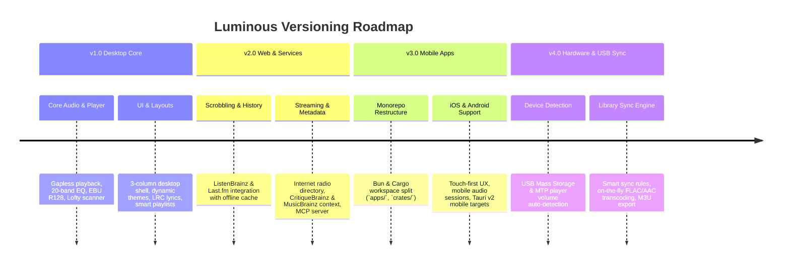

#  Luminous Roadmap

This document outlines the versioning roadmap, major milestones, and strategic direction for **Luminous Music Player**.

---

## Release Roadmap Overview



---

## Milestones Detail

### [Milestone 1.0 — Core Desktop Player & Local Collection](https://github.com/esoltys/luminous/milestone/1)

**Focus**: Establishing a high-performance desktop music player for local audio collections with an audiophile playback engine and modern Svelte 5 user interface.

*   **Audiophile Audio Pipeline**:
    *   Symphonia decoding + CPAL output thread with allocation-free playback loop.
    *   True gapless playback with double-buffered audio streaming.
    *   Dual-mode Equalizer: 10-band graphic equalizer & 20-band parametric DSP filters.
    *   EBU R128 loudness normalization and ReplayGain fallback.
*   **Modern Desktop Interface**:
    *   Resizable 3-column layout (sidebar navigation, central core canvas, right context pane).
    *   Adaptive Information Density matrix (Compact, Balanced, Expanded).
    *   Personalized Home Hub, Category Explorer, and instant database search.
    *   Synchronized `.LRC` scrolling lyrics and detached Picture-in-Picture miniplayer.
*   **Local Collection & Metadata Engine**:
    *   Incremental filesystem scanner and file watcher powered by `lofty`.
    *   SQLite database with full-text search (FTS5).
    *   AcoustID audio fingerprinting (`fpcalc`) and tag reader/writer.
    *   Smart Playlists GUI rule builder with type-safe SQL query translation.

---

### [Milestone 2.0 — Web & External Services Release](https://github.com/esoltys/luminous/milestone/2)

**Focus**: Expanding Luminous beyond local files by integrating 3rd-party web services, streaming radio, cloud metadata, Discord social presence, and developer automation APIs.

*   **Scrobbling & Play History Sync**:
    *   Native background scrobbling to **ListenBrainz** & **Last.fm** ([#83](https://github.com/esoltys/luminous/issues/83)).
    *   Offline play log queueing with automatic re-sync upon internet reconnect.
*   **Streaming Internet Radio**:
    *   Online station directory search with genre categories and stream bookmarking ([#82](https://github.com/esoltys/luminous/issues/82)).
    *   Live ICY metadata parsing for currently playing radio tracks.
*   **Rich Web Context & Reviews**:
    *   Details pane context integrating MusicBrainz ID resolution, CritiqueBrainz album reviews, Wikipedia bios, and TheAudioDB ratings ([#23](https://github.com/esoltys/luminous/issues/23)).
*   **Discord Integration & Smart Notifications**:
    *   Discord Rich Presence (RPC) status broadcasting with live track metadata and album artwork ([#29](https://github.com/esoltys/luminous/issues/29)).
    *   Discord-aware smart notifications with adaptive suppression during voice calls and active gaming sessions.
    *   Unified OS desktop alerts and glassmorphic toast notifications for background tasks and scrobble status.
*   **Developer Automation & Protocol Support**:
    *   Built-in **Model Context Protocol (MCP)** server for programmatic integration with AI agents and external tools ([#84](https://github.com/esoltys/luminous/issues/84)).
    *   User-editable JSON settings engine with VS Code style configuration UI ([#24](https://github.com/esoltys/luminous/issues/24)).

---

### [Milestone 3.0 — Mobile Apps & Monorepo Architecture](https://github.com/esoltys/luminous/milestone/3)

**Focus**: Re-architecting Luminous into a multi-platform workspace monorepo supporting **iOS** and **Android** alongside Desktop.

*   **Workspace Monorepo Structure**:
    *   Split repository into reusable `apps/` and `crates/` packages:
        ```
        ├── apps/
        │   ├── web-frontend/       # Shared Svelte 5 components, design tokens, stores
        │   ├── tauri-desktop/      # Desktop Tauri v2 configuration & tray plugins
        │   └── tauri-mobile/       # Mobile Tauri v2 configuration & touch capabilities
        └── crates/
            ├── core-logic/         # Pure Rust business logic (database, models, playlists)
            └── audio-engine/       # Symphonia decoding, DSP, & portable audio engine
        ```
*   **Mobile-Native User Experience**:
    *   Dedicated touch-first view hierarchy (bottom transport bar, gesture navigation, swipeable queues).
    *   Mobile OS background audio sessions, Lock Screen media controls, and Bluetooth remote events.
*   **Platform Isolation & Capability Security**:
    *   Desktop-only plugins isolated to `tauri-desktop`.
    *   Mobile capability maps (`capabilities/*.json`) configured for sandboxed mobile webviews.

---

### [Milestone 4.0 — USB Music Player Sync & Portable Hardware](https://github.com/esoltys/luminous/milestone/4)

**Focus**: Adding support for external hardware, portable Digital Audio Players (DAPs / MP3 players / iPods), and USB storage synchronization.

*   **Device Detection & Protocols**:
    *   Automated volume detection for USB Mass Storage (MSC) devices and Media Transfer Protocol (MTP) players.
*   **Library Synchronization Engine**:
    *   One-way or two-way sync rules (sync entire library, selected playlists, or smart auto-fill based on device storage capacity).
*   **On-the-Fly Transcoding & Playlist Export**:
    *   Automatic format conversion (e.g. FLAC to AAC/MP3) tailored to device hardware capabilities.
    *   Playlist export generation (`.m3u`, `.m3u8`, `.pls`) matching legacy hardware folder structures.

---

## Beyond v4.0 & Future Exploration

Ideas under consideration for future releases:
*   **Cloud Storage & Self-Hosted Sources**: Streaming from Subsonic/Navidrome, WebDAV, or cloud storage providers.
*   **Network Casting**: UPnP / DLNA / Chromecast audio output target support.
*   **Multi-Room Audio**: Synchronized local network audio streaming.

---

## Related Resources

*   [GitHub Issues](https://github.com/esoltys/luminous/issues)
*   [GitHub Milestones](https://github.com/esoltys/luminous/milestones)
