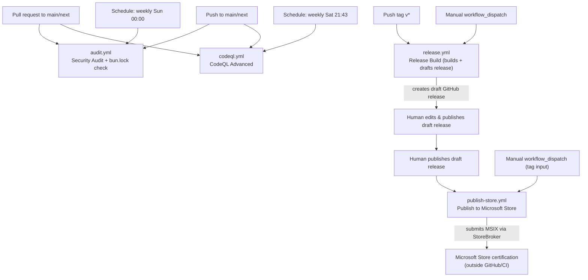

# CI/CD Pipeline

This documents the actual GitHub Actions pipeline as it exists in `.github/workflows/`.
There are four workflow files: `audit.yml`, `codeql.yml`, `release.yml`, and
`publish-store.yml`. There is no separate lint/test/clippy workflow — those checks
(`bun run check`, `bun run test:run`, `cargo test`, `cargo clippy`) are **not** run by
GitHub Actions today; they're manual steps in [`docs/RELEASE_CHECKLIST.md`](./RELEASE_CHECKLIST.md)
that a human runs locally before cutting a release. If you're expecting a CI job to catch
a failing test or a clippy warning on your PR, it won't — only the two workflows below run
on PRs.

## What runs on pull requests (and pushes to `main`/`next`)

Both of these trigger on `pull_request` and `push` targeting `main` or `next`, plus a
weekly `schedule`:

- **`audit.yml` — Security Audit**
  - `security_audit` job: runs `rustsec/audit-check@v2` against `Cargo.lock` to catch
    known-vulnerable Rust dependencies.
  - `lockfile_check` job: runs `bun install --frozen-lockfile` to fail if `bun.lock` has
    drifted from `package.json` (i.e. someone changed a dependency range without
    regenerating the lockfile).
- **`codeql.yml` — CodeQL Advanced**
  - Runs GitHub's CodeQL static analysis across three language matrix legs: `actions`,
    `javascript-typescript`, and `rust` (all `build-mode: none`, i.e. CodeQL's own
    extraction rather than a real build — except Rust still runs `cargo check` first to
    generate code CodeQL can analyze).
  - Findings are uploaded to the repo's Security tab (`security-events: write`).

Both are also on a `schedule` (audit: weekly Sunday midnight; CodeQL: weekly Saturday
21:43 UTC), so they catch newly-disclosed vulnerabilities even without new commits.

## What runs on merge to `main`

Merging a PR to `main` is itself just a `push` to `main`, so it re-triggers `audit.yml`
and `codeql.yml` exactly as above. Nothing else fires automatically on merge — the actual
release build only happens when a `v*` tag is pushed (see below), which per
`RELEASE_CHECKLIST.md` is a separate, deliberate, manual step after the version-bump PR
merges.

## The release pipeline

### 1. `release.yml` — Release Build

Triggers: `push` of a tag matching `v*`, or manual `workflow_dispatch`. (An earlier
version of this workflow also listened for `release: published`, but neither job's `if:`
guard ever matched that event — it just produced a confusing no-op run every time a
release was published, so the trigger was removed.)

- **`create-release` job** (Linux only): determines the tag (from the ref, or from
  `package.json` version for manual dispatch), then creates a **draft** GitHub release for
  that tag via `gh release create ... --draft` (or reuses one if it already exists). This
  runs once, up front, so the matrix build below doesn't race to create duplicate drafts.
- **`release` job** (matrix: `ubuntu-24.04`, `windows-latest`), depends on `create-release`:
  - Installs deps with `bun install`, plus Linux system deps (webkit2gtk, ALSA, OpenSSL,
    appindicator, librsvg) on the Ubuntu leg.
  - Runs `tauri-apps/tauri-action@v0` (wrapped in `Wandalen/wretry.action@v3` for retry
    on transient failures) to build and sign the app, uploading artifacts into the draft
    release created above (`releaseDraft: true`).
  - On the Windows leg only: builds an MSIX package (`bun run tauri:windows:build`) and
    uploads it to the release assets via `softprops/action-gh-release@v2` (again with
    `draft: true` — the action would otherwise publish the release outright).

At the end of this workflow, the GitHub release exists as a **draft** with Linux + Windows
bundles (and MSIX) attached. It is not visible to end users yet.

### 2. Manual: publishing the draft release

Per `RELEASE_CHECKLIST.md`, a human edits the draft release body (replacing the
auto-generated notes with `docs/release-notes/vX.Y.Z.md`), optionally enables "Create a
discussion for this release," and clicks **Publish**. This is a manual GitHub UI action —
no workflow does it automatically.

### 3. `publish-store.yml` — Publish to Microsoft Store

Triggers: `release: published` (fires the moment the human publishes the draft above), or
manual `workflow_dispatch` with a required `tag` input (for retrying a submission against
an already-published release).

- Downloads the release's `.msix`/`.msixbundle` asset via `gh release download`, preferring
  a plain `.msix` over `.msixbundle` (StoreBroker's bundle-metadata reader can't locate the
  inner package inside a `.msixbundle`).
- Runs `.github/store/Submit-ToMicrosoftStore.ps1`, which uses Microsoft's StoreBroker
  PowerShell module to call `Update-ApplicationSubmission -ReplacePackages` against the
  Microsoft Store submission API, authenticating with `STORE_TENANT_ID` /
  `STORE_CLIENT_ID` / `STORE_CLIENT_SECRET` / `STORE_APP_ID` secrets.
- This is a separate workflow from `release.yml` on purpose: it doesn't depend on (and
  isn't skipped by) the build job, and can be re-run independently.
- A green run of this workflow only means the submission was **committed for
  certification** — Microsoft's own cert pass still has to complete before the update is
  live in the Store. See [`.github/store/README.md`](../.github/store/README.md) for how
  `sbConfig.json` and the submission script are structured, including a gotcha about
  `//` in JSON string values breaking StoreBroker's comment stripper.

## Trigger graph

One thing worth calling out explicitly since it's easy to miss reading the YAML in
isolation:

- `publish-store.yml` is decoupled from `release.yml` entirely — it only cares about the
  release being published, not about how it got built. That's deliberate (see
  `RELEASE_CHECKLIST.md`), and it's why it can be re-run via `workflow_dispatch` without
  re-running the whole build.
