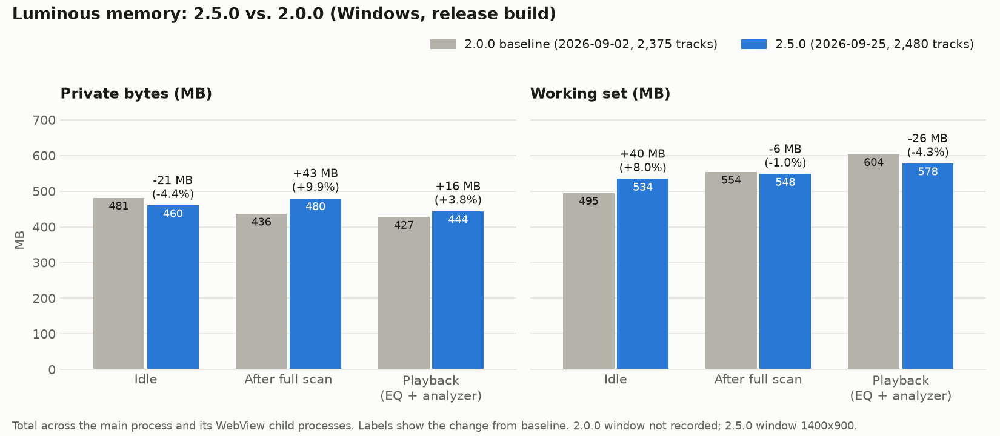

# Performance Baseline

Tracks Luminous's steady-state memory footprint so a PR can be checked against a known baseline
before/after a change, instead of relying on "it feels heavier." See #706.

## Methodology

- **What's measured**: total memory across the app's main process and every child process it
  spawns (e.g. WebView2 renderer/GPU processes on Windows, a WebKitGTK web process on Linux) —
  this matches what a user perceives as "Luminous's memory usage" in Task Manager/`top`, not just
  the thin main process.
- **Numbers reported**: working set (Windows) / RSS (Linux) as the "what's actually resident"
  figure, and private bytes (Windows) / private Pss (Linux, via `/proc/<pid>/smaps_rollup`) as the
  "what's not shared with other processes" figure. Private bytes/Pss is the more meaningful number
  for comparing builds, since working set/RSS includes shared pages (e.g. WebView2 runtime code)
  that don't change with Luminous's own code.
- **Build measured**: a release build (`bun run tauri build --no-bundle`), not the dev server — the
  dev server's Vite/HMR overhead isn't representative of what ships to users.
- **Held constant between runs**: the window is on screen at a fixed size, the app launches fresh
  into Collection → Songs with nothing selected, each scenario settles before sampling, and the
  recorded figure is the median of 5 readings. Each of these moves the numbers on its own: a
  minimized WebView2 reads ~100MB lower than a visible one, and the restored view alone shifted idle
  private bytes by ~26MB between otherwise identical runs.

## Running it

**Windows**: one command runs all three scenarios the same way every time and appends one row per
scenario to `docs/performance-history.csv`:

```bash
bun run tauri build --no-bundle
bun run perf:memory -- --app-version 2.5.0
```

`scripts/perf-memory-scenarios.ts` launches the release exe with WebView2's DevTools port open and
triggers each scenario through the same IPC calls the UI's buttons make (Force Full Scan, Play). It
runs against your real library and settings, and restores the view, window placement, EQ state and
playback position it changed before closing the app. Playback is audible for about a minute. It
starts from 0:00 of whatever track is loaded and stops before the track's halfway mark, so it never
records a play or scrobble. Pass `--app-version` when measuring before the version bump, since
`package.json` still has the previous version then. It refuses to run if Luminous is already open or
the exe is older than the last app-source commit.

**Linux**: the scenario script needs WebView2's DevTools protocol, so drive the app by hand and
take each reading with `measure-memory`, keeping the window on screen at a consistent size:

```bash
bun run measure-memory -- --label idle --samples 5 --app-version 2.5.0 --tracks 99 --csv docs/performance-history.csv
```

**Comparing versions**: `scripts/perf-chart.py` (needs `pip install matplotlib`) draws the chart
below and prints the Markdown delta table from the CSV. For each version and scenario it uses the
newest row, so a re-run supersedes an earlier one without deleting history:

```bash
bun run perf:chart -- --baseline 2.0.0 --candidate 2.5.0
```

## Scenarios

1. **Idle** — app freshly launched, library already scanned from a prior run, no playback.
2. **After a full library scan** — freshly launched, then a forced full rescan triggered and run to
   completion.
3. **During playback** — a track playing, with the equalizer and spectrum analyzer enabled.

## Baseline results

Dates are UTC. Each figure is the newest row for that version/OS/scenario in
`docs/performance-history.csv`, which also has every raw reading.

| Date | App version | OS | Library size | Window | Scenario | Working set (MB) | Private bytes (MB) |
| --- | --- | --- | --- | --- | --- | --- | --- |
| 2026-09-02 | 2.0.0 | Windows 11 | 2,375 tracks | not recorded | Idle | 494.9 | 481.3 |
| 2026-09-02 | 2.0.0 | Windows 11 | 2,375 tracks | not recorded | After full scan | 553.7 | 436.5 |
| 2026-09-02 | 2.0.0 | Windows 11 | 2,375 tracks | not recorded | During playback (EQ + analyzer on) | 603.6 | 427.4 |
| 2026-09-02 | 2.0.0 | Linux (CachyOS, WebKitGTK) | 99 tracks | not recorded | Idle | 500.5 | 289.3 |
| 2026-09-02 | 2.0.0 | Linux (CachyOS, WebKitGTK) | 99 tracks | not recorded | After full scan | 486.5 | 275.8 |
| 2026-09-02 | 2.0.0 | Linux (CachyOS, WebKitGTK) | 99 tracks | not recorded | During playback (EQ + analyzer on) | 543.7 | 332.6 |
| 2026-09-25 | 2.5.0 (`1d562877`) | Windows 11 | 2,480 tracks | 1400x900 | Idle | 534.4 | 460.2 |
| 2026-09-25 | 2.5.0 (`1d562877`) | Windows 11 | 2,480 tracks | 1400x900 | After full scan | 547.6 | 479.3 |
| 2026-09-25 | 2.5.0 (`1d562877`) | Windows 11 | 2,480 tracks | 1400x900 | During playback (EQ + analyzer on) | 576.0 | 443.7 |

Process count was 7 in every Windows scenario (main process + 6 WebView2 subprocesses — renderer,
GPU, network, etc. — a fixed cost of the WebView2 runtime, not something Luminous's own code
controls). On Linux, process count varied between 3 and 6: the steady-state tree is the main
process + WebKitNetworkProcess + WebKitWebProcess, with a transient sandboxed `glycin-svg`
image-loader process (launched via `bwrap`) spinning up briefly during cover art rendering. This is
expected — WebKitGTK's process model differs from WebView2's — not a bug or a leak signature.

## Assessment

### 2.0 (2026-09-02)

Windows: private bytes stayed flat-to-slightly-down across scenarios (481 → 436 → 427 MB) rather
than climbing, and working set only grew modestly (495 → 554 → 604 MB) as more code paths
(scanner, EQ, analyzer) got paged in — neither pattern suggests a leak. ~430-480MB of private
memory for a WebView2-based app is in line with what the WebView2 runtime itself typically costs
before counting any of Luminous's own state (a bare WebView2 host process commonly runs
150-300MB), so these numbers look reasonable for the app's scope.

Linux: private bytes are noticeably lower than Windows across the board (289 → 276 → 333 MB vs.
481 → 436 → 427 MB) — expected, since WebKitGTK's runtime footprint is smaller than WebView2's and
this machine's library is much smaller (99 vs. 2,375 tracks). The same flat/non-climbing pattern
holds: no scenario shows unbounded growth. The playback+EQ+analyzer scenario was noticeably
noisier than idle/after-scan on Linux (individual readings ranged roughly 486-640MB working set
before settling), most likely GC/allocation churn from the spectrum analyzer's per-frame typed
array usage in the WebView's JS heap; the reported figure is from two consecutive readings that
had converged. Nothing on either platform warrants a code change.

### 2.5 vs. 2.0 (Windows)



| Scenario | Private bytes Δ | Working set Δ |
| --- | --- | --- |
| Idle | −21.1 MB (−4.4%) | +39.5 MB (+8.0%) |
| After full scan | +43.2 MB (+9.9%) | −5.7 MB (−1.0%) |
| During playback (EQ + analyzer on) | +16.3 MB (+3.8%) | −26.0 MB (−4.3%) |

No regression shows up, but treat these deltas with caution. The 2.0 readings were single snapshots
taken before the view and window size were held constant, and those two factors alone move the
numbers by as much as the deltas above. An uncontrolled 2.5 run on the same day read 486.5 MB idle
private bytes against 460.2 MB here, which is enough to flip the idle result from +1.1% to −4.4%.
Private bytes still don't climb across scenarios, and the forced full scan of 2,480 tracks took
3.0s. Linux wasn't re-measured for 2.5.

The 2.5 rows are the first taken with every condition held constant, so they're the baseline to
compare future releases against. Two back-to-back scripted runs differed by 2-13MB of private bytes
per scenario, so a change under ~3% is within run-to-run noise. Measuring against a fixed test
library instead of the real one would remove library drift and allow a controlled re-run of 2.0.0
(#1197).

## Candidate areas if numbers look high in the future

- `src-tauri/src/db.rs` — the r2d2 pool caps at 8 connections, each with `PRAGMA cache_size=-32000`
  (32MB), so SQLite's own page cache alone can reach ~256MB in the worst case where all 8
  connections are hot simultaneously. Cover art extraction, analyzer buffers, and the library
  scanner (batched at 300 songs/chunk) are already bounded by design and are not expected to be
  concerns.

## Tokio scheduler diagnostics (tokio-console)

Tracks scheduler-level questions the memory baseline above can't answer — is an `AppState`
mutex held across blocking I/O, is a task hogging a worker thread on a single poll, is a
background loop's tick getting delayed. See #1002 for the audit this was built for.

This is an A/B tool for checking a specific fix, not a release-to-release comparison. It runs
against a dev build (`tokio-console` needs a feature flag and `tokio_unstable`, so it can't be
compiled into a release build), and its wall times depend on the machine and library. It isn't
re-run each release. The memory scenarios above are the release-to-release check.

### Setup

`console-subscriber` is an optional dependency behind the `tokio-console` Cargo feature (off by
default — never enabled in a release build, `bun run tauri build`, or CI). Enabling it also
requires the `tokio_unstable` rustc cfg flag, since `console-subscriber` reads Tokio APIs that are
exempted from semver stability guarantees; that flag is intentionally not baked into
`.cargo/config.toml`, so it has to be passed explicitly per invocation:

```bash
cargo install tokio-console  # once, the separate viewer CLI
RUSTFLAGS="--cfg tokio_unstable" bun run tauri dev -- --features tokio-console
```

On Windows, the `VAR=value cmd` inline-env syntax above only works in a POSIX shell (Git Bash,
WSL). In PowerShell, set the variable as a separate statement first:

```powershell
$env:RUSTFLAGS="--cfg tokio_unstable"; bun run tauri dev -- --features tokio-console
```

This project uses the JS-side Tauri CLI (`bun run tauri`, see `package.json`), not the
`cargo-tauri` crate — `cargo tauri dev` won't work here unless `cargo install tauri-cli` has been
run separately. `bun run tauri dev` shells out to `cargo build`/`cargo run` for the Rust side, so
`RUSTFLAGS` set in the environment still reaches that build; `--` forwards `--features
tokio-console` through the JS CLI to the underlying `cargo` invocation.

Then in another terminal, `tokio-console` connects to the running app and shows a live table of
every Tokio task — poll count, total busy time, idle time, and warnings for a task that blocked a
worker thread for a long single poll. No manual `#[tracing::instrument]` annotations are needed to
get started: `tokio::spawn`/`spawn_blocking` already emit the tracing events `console-subscriber`
reads, so every IPC command handler and background loop (`spawn_visualizer_loop`,
`spawn_position_tick_loop`, `spawn_scheduler_latency_monitor`, the bridge server's per-connection
tasks, etc.) shows up automatically.

### Using it for A/B comparisons

`scripts/perf-scenario-bridge.sh` drives the app's local bridge server (`src-tauri/src/bridge.rs`)
via `curl` so the same scenario can be replayed identically across builds, without GUI automation:

```bash
./scripts/perf-scenario-bridge.sh skip-tracks 50    # POST "next" 50 times in a row
./scripts/perf-scenario-bridge.sh bridge-flood 200  # 200 concurrent GET /health requests
```

`skip-tracks` targets the `Player::next_track()` path (the loudness-settings mutex/blocking-I/O
fix); `bridge-flood` targets the bridge server's connection-concurrency cap. It needs the app
already running (`bun run tauri dev`).

**One-time setup for `skip-tracks`**: it queues the checked-in test fixtures
(`src-tauri/tests/fixtures/audio/`) rather than anything from your personal library, so they need
to already be scanned into the library's DB once before the script can find their song IDs — add
that folder as a watched library folder in the running app (Settings → Library) and let it scan
(near-instant, six tiny clips). The script errors out with this same instruction if it can't find
them. `bridge-flood` doesn't need this — it doesn't touch playback at all.

1. Build/run the "before" version (e.g. `main`, or the commit before a fix) with the `tokio-console`
   setup above and run the relevant scenario script against it.
2. In `tokio-console`, note the task(s) relevant to the change: its poll count, max single-poll
   duration, and total busy time.
3. Rebuild on the "after" branch, run the identical script, and compare the same numbers for the
   same task.

### First recorded run (2026-09-15)

| Date | App version | OS | Scenario | Runs | Wall time | Scheduler-delay warnings |
| --- | --- | --- | --- | --- | --- | --- |
| 2026-09-15 | 2.0.0 | Linux (CachyOS, WebKitGTK) | `skip-tracks 50` | 3 | 0.607s, 0.693s, 0.626s | 2 (both during crossfade/cover-art work, not the loudness DB read) |
| 2026-09-15 | 2.0.0 | Linux (CachyOS, WebKitGTK) | `bridge-flood 200` | 3 | 0.256s, 0.289s, 0.273s | 0 |
| 2026-09-15 | 2.0.0 | Windows 11 | `skip-tracks 50` | 3 | 2.905s, 2.640s, 2.717s | 0 |
| 2026-09-15 | 2.0.0 | Windows 11 | `bridge-flood 200` | 3 | 2.420s, 2.173s, 2.124s | 0 |

**Windows vs. Linux**: zero scheduler-delay warnings on Windows across all 6 runs (even better than
Linux's 2), so no evidence of scheduler contention on this platform either. Wall times are
consistently higher than Linux's for both scenarios (`skip-tracks 50` ~2.6-2.9s vs. ~0.6-0.7s;
`bridge-flood 200` ~2.1-2.4s vs. ~0.26-0.29s) — this tracks with the two runs being on different
machines with different libraries (2,375 tracks on Windows vs. 99 on Linux, see the memory baseline
table above) and isn't itself a scheduler-latency signal; the watchdog and warning count are the
relevant metric here, not raw wall time, since the script's HTTP/DB round-trip overhead dominates
wall time on both platforms.

**What this is, and isn't**: this was run against the current (post-fix) code only — this branch
already has the `spawn_blocking` and connection-semaphore fixes applied, so it's not a true
before/after comparison; getting one would mean reverting those changes, rebuilding, and
re-running against a live dev session, which wasn't worth the disruption for this pass. What it
does establish: post-fix, `bridge-flood 200` never triggered a scheduler-delay warning across 3
runs (600 requests total) and the server stayed responsive throughout — consistent with (but not
proof of) the connection-semaphore fix working. `skip-tracks 50` did trigger 2 warnings (65ms and
77ms overshoot), but both landed during an auto-crossfade transition and cover-art resolution, not
during the loudness-settings read itself — real audio-pipeline work, not obviously the mutex/DB
issue the fix targeted. Per-task `tokio-console` busy/poll numbers (the more precise signal for
isolating the loudness fix specifically) weren't captured here — that needs the interactive
`tokio-console` viewer attached during the run, which wasn't done for this pass. A more conclusive
before/after would need: (a) the pre-fix commit rebuilt and run through the identical script, and
(b) `tokio-console` actually open and watched during both runs rather than relying on the coarser
log-based watchdog.

### The always-on watchdog

`spawn_scheduler_latency_monitor()` (`src-tauri/src/lib.rs`) is a dependency-free proxy for the
same signal — it logs a warning if a 20ms sleep overshoots by more than 40ms, indicating the
runtime fell behind. It's coarser than `tokio-console` (no per-task breakdown, just "the runtime
was late") but runs in every debug build with no special flags or features, so it's the first
thing to check before reaching for the full `tokio-console` setup above.

It's just a `log::warn!` call, so it shows up like any other backend log line:

```bash
bun run tauri dev
```

Watch the terminal for lines containing `Tokio scheduler delay detected` while you run
`scripts/perf-scenario-bridge.sh` (or drive the app by hand) — the default log level (`info`, see
`env_logger::Builder` in `run()`) already includes `warn`, so no `RUST_LOG` override is needed.
Each line reports the probe's actual elapsed time and overshoot in ms.

For an A/B comparison without `tokio-console`, redirect to a file and count occurrences over an
identical run of the scenario script on each build:

```bash
bun run tauri dev 2>&1 | tee /tmp/luminous-dev.log &
./scripts/perf-scenario-bridge.sh skip-tracks 50
grep -c "Tokio scheduler delay detected" /tmp/luminous-dev.log
```

Fewer (or zero) hits on the "after" build than the "before" build is evidence the fix reduced
scheduler contention. A silent run either way isn't proof of nothing changed, though — the 40ms
threshold only fires on fairly gross stalls, so `tokio-console`'s per-task busy-time numbers are
the more sensitive signal for a change that shaves a few milliseconds rather than causing an
outright pileup.
